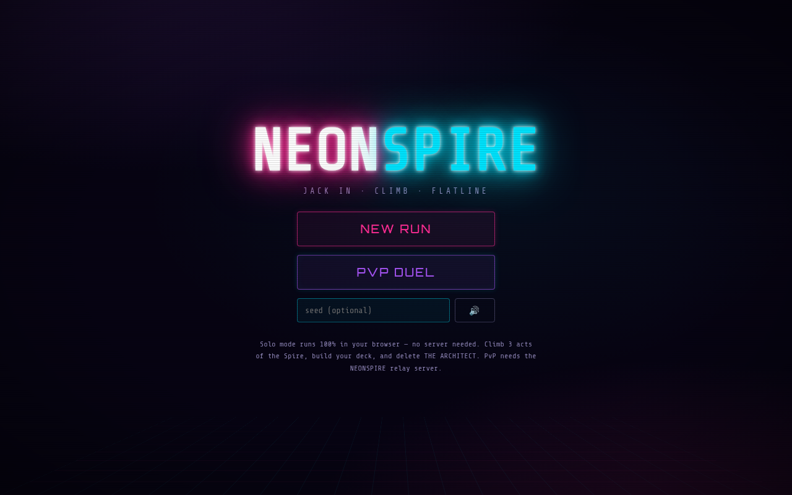
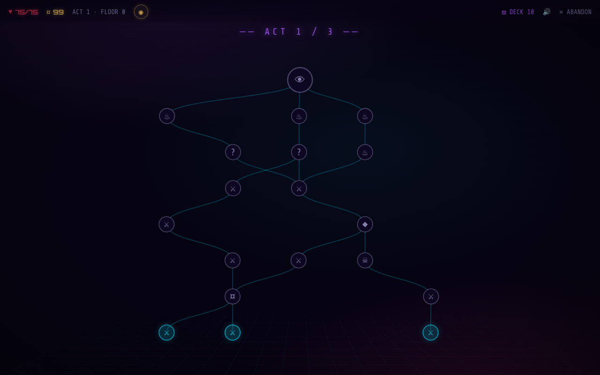
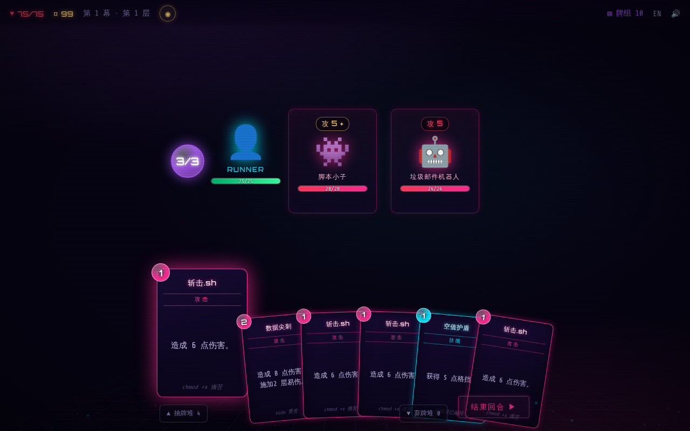
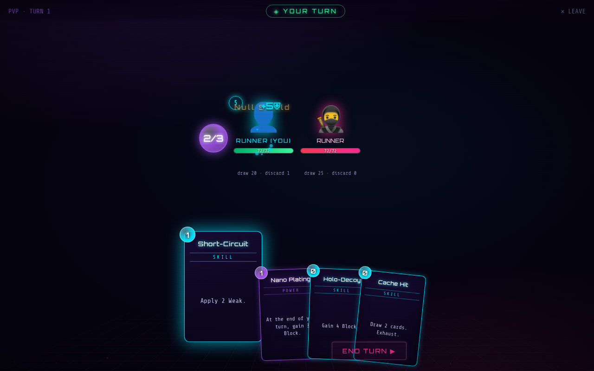

# NEONSPIRE

A neon-cyberpunk, Slay-the-Spire-like deck-building roguelike for the browser.
Climb three acts of procedurally generated maps, fight AI-driven enemies in
turn-based card combat, collect cards and relics — then delete **THE ARCHITECT**.

Fully bilingual: **English / 简体中文** — auto-detected from the browser, live
toggle in the menu and top bar (中 / EN).


| | |
|---|---|
|  |  |

## Play

```bash
npm install
npm run dev          # solo mode at http://localhost:5173 — fully offline, no backend
```

Solo vs. AI is **100% standalone**: every rule runs in the browser, runs
auto-save to `localStorage`, and the built app is a static bundle (~29 KB
gzipped JS) you can host anywhere.

### PvP (optional)

```bash
npm run dev:server   # WebSocket matchmaking + rules server on :8787
```

Open the game, hit **PVP DUEL**, queue in two tabs (or two machines pointed at
the same server). For production: `npm run build && npm start` — the server
serves the built client and the WebSocket on one port.

```bash
npm test             # engine test suite (21 tests, incl. full simulated runs)
npm run typecheck    # strict TS across all three packages
```

## The one-engine rule

The whole point of the architecture: **game logic exists exactly once.**

```
shared/   @neonspire/engine — pure TypeScript, zero dependencies, no DOM/Node APIs
client/   Preact UI — imports the engine, runs it locally for solo mode
server/   Node + ws — imports the SAME engine to validate every PvP move
```

- `shared/src/core.ts` is the only implementation of combat math: damage
  modifiers (Strength / Weak / Vulnerable), block, thorns, poison ticks, the
  card-effect interpreter, draw/discard/exhaust piles.
- PvE (`combat.ts`) and PvP (`pvp.ts`) are thin reducers over those primitives:
  `(state, action) → { state, events }`. States are plain JSON; the RNG is a
  seeded `mulberry32` stored *inside* the state, so any sequence of actions
  replays identically anywhere — that's what makes server-side validation
  trivial and lets the client persist mid-combat saves.
- The server never trusts a client: it runs `pvpReduce` on every message,
  rejects illegal actions (`not your turn`, `not enough energy`, …), and sends
  back **redacted views** (`viewFor`) — your opponent's hand and draw order
  never leave the server.
- Card rules text is *generated from the effect data* (`describeCard`), so a
  card can never say one thing and do another.
- Localization follows the same rule: since the engine generates all rules
  text, the Chinese translation lives in the engine too (`locale-zh.ts` +
  per-locale text templates). Game state never contains localized strings —
  locale is purely a render-time concern, so PvP stays locale-agnostic and a
  test enforces that every card/relic/enemy/move/event has a zh entry.



## Game content

- **THREE playable characters** — RUNNER (versatile netdiver); VECTOR, a
  volatile overclocker built on the Heat mechanic (attacks ride +1 damage per
  Heat stack, overheating past the threshold burns you for all of it, vent
  cards cash it out, and the Reactor power turns meltdowns into AoE); and
  GHOST, a stance phaser who flickers between **Overdrive** (deal ×1.5, take
  ×1.5) and **Stealth** (take ×0.5, +2 energy on exit), with stance-trigger
  powers that pay block, Strength, and draws on every switch.
- **113 playable cards** across per-character pools and three RUNNER build
  archetypes —
  Corrupt/virus (Payload Burst, Fork Virus, Chronic Injector), block-fortress
  (Firmware Lock/Barricade, Kernel Panic, Double Buffer), and 0-cost tempo
  (Hyperthread, Burst Compile) — every card with a distinct upgrade, plus
  **Innate / Retain / Ethereal** keywords (Boot Disk opens every hand, Slow
  Burn never leaves it, Sunflare burns away if you sit on it). Junk
  **Glitch** cards can infect your deck, and **Lag** curses (unplayable dead
  draws) come from cursed events and Ascension 2+.
- **51 relics** with combat/economy hooks (including character-exclusive relics that only appear in the right pools) — including double-edged boss picks
  like the Berserker Chip (+2 Strength, −10 Max HP) — plus a **choice of boss
  relics** after each act boss and a Neow-style **BOOT SEQUENCE** bonus at run
  start.
- **16 potions** on a 3-slot belt (droppable via a hover ✕) (rules text generated by the same effect
  interpreter as cards) — drops, shop stock, and event rewards.
- **Ascension 0–10** (win to unlock the next level), each level adding a
  distinct twist — enemy scaling, starter curses, leaner credits, stronger
  elites, lower Max HP, weaker rests, rarer potions, marked-up shops,
  narrowed boss picks — with the active modifier described on the menu. Plus
  a **daily seeded run**, an end-of-run **score breakdown**, and local run
  history (with scores).
- **26 statuses**: Strength, Weak, Vulnerable, Corrupt (poison), Thorns,
  Plating, Turret, Viral, Overclock, Uplink, Ritual, Regen, Barricade, Kernel,
  Hyperthread, Chronic, **Artifact** (negates the next debuff — late elites
  and THE ROOT come armored with it), VECTOR's Heat / Coolant / Ignition /
  Reactor, and GHOST's Overdrive / Stealth stances with Stance Wall, Momentum
  and Tempo Loop triggers.
- **Sustain package** for softer runs: Hotfix, Checkpoint, Backup Restore
  (heals), Leech Query (lifesteal), Auto-Repair (Regen power), Nano Medkit /
  Solar Cell relics.
- **Cheat console** (solo only — the PvP server validates every move): the
  `⌁ CHEATS` button in the top bar opens full heal, +credits, +max HP,
  upgrade-everything, add-any-card/relic, free card deletion, and in-combat
  kill-all / +energy / draw. Difficulty is a suggestion.
- **3 acts + a secret Act 4, 31 enemies, 7 bosses** — every act rotates
  between two bosses, with summoner broods, phase-shifting bosses, an
  Artifact-armored elite and a permanently-stealthed phantom — on a
  Spire-style branching node map:
  combats, elites, rest sites, shops (buy/remove/potions), treasure vaults,
  and 25 narrative events. Beat Act 3 and choose: jack out with the win, or
  **descend into THE ROOT** — a fixed gauntlet ending in a true final boss
  that grows stronger every turn — for the deep-clear score bonus.
- **Smart enemy AI**: enemies pick intents by scoring moves against the actual
  board — they go for lethal when it's on the table, turtle when wounded, apply
  Weak when you stack Strength, punish your Vulnerability, and never repeat
  moves into the ground. See `chooseMove` in `shared/src/enemies.ts`.
- **PvP duels**: mirrored 25-card decks, alternating turns, +1 energy to the
  second player's first turn; powers like Auto-Turret and Viral Load target
  your opponent.



## Tech

Preact + `@preact/signals` (tiny, smooth), Vite, self-hosted Orbitron/Share
Tech Mono (no CDN — offline-first), canvas particle system + CSS scanlines &
glow for the neon look, WebAudio synth SFX (no audio assets), Node `ws` server
run with `tsx` so the TypeScript engine is imported from source everywhere —
no build step, no drift.
