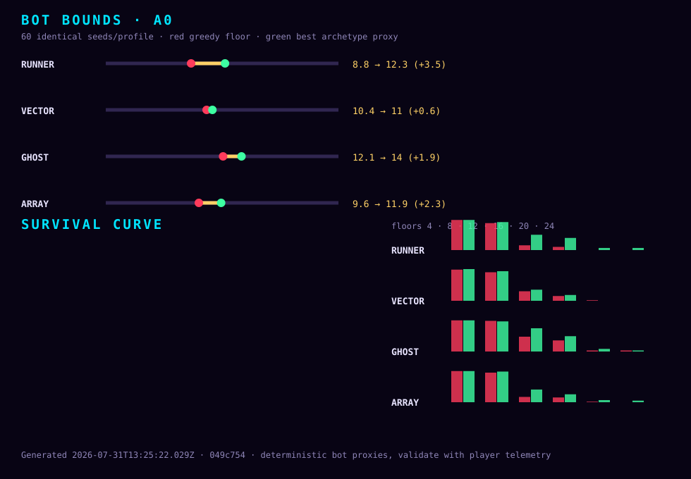

# NEONSPIRE 平衡实验室

> 2026-07-31 · commit `049c754` · 60 seeds/profile · A0

## 角色上下限

| 角色 | 贪心下限均层 | 最佳流派均层 | 可控空间 | 最佳流派 | 胜率变化 |
|---|---:|---:|---:|---|---:|
| runner | 8.8 | 12.3 | +3.5 | runner-tempo | 0% → 1.7% |
| vector | 10.4 | 11 | +0.6 | vector-furnace | 0% → 0% |
| ghost | 12.1 | 14 | +1.9 | ghost-dance | 0% → 1.7% |
| array | 9.6 | 11.9 | +2.3 | array-plating | 0% → 3.3% |

“上限”是流派策略 bot 的可复现实战近似值，不是理论无限 combo；“下限”是保留旧逻辑的贪心 bot。二者使用完全相同的 seeds。

## 全量分布

| 角色 | 策略 / 流派 | 胜率 | 均层 | P25/P50/P75/P90 | 死亡幕 1/2/3/4 | 到达层 4/8/12/16/20/24 | 回合/战 | 牌组 |
|---|---|---:|---:|---:|---:|---:|---:|---:|
| runner | 贪心下限 / Greedy floor | 0% | 8.8 | 8/8/9.3/14.2 | 40/20/0/0 | 95%/85%/15%/10%/0%/0% | 6.82 | 14.3 |
| runner | 病毒腐蚀 / Corrupt | 0% | 7.3 | 6/8/8/9 | 46/14/0/0 | 88.3%/68.3%/3.3%/1.7%/0%/0% | 3.96 | 13.9 |
| runner | 格挡堡垒 / Fortress | 0% | 7.4 | 6/8/8.3/10.1 | 45/15/0/0 | 86.7%/63.3%/6.7%/1.7%/0%/0% | 4.76 | 14 |
| runner | 零费节奏 / 0-cost Tempo | 1.7% | 12.1 | 8/11/16/16 | 17/39/3/0 | 91.7%/85%/48.3%/38.3%/6.7%/6.7% | 3.39 | 16.7 |
| runner | 流派上限包络 / Ceiling envelope | 1.7% | 12.3 | 8/11/16/16 | 16/40/3/0 | 95%/88.3%/48.3%/38.3%/6.7%/6.7% | 3.44 | 16.7 |
| vector | 贪心下限 / Greedy floor | 0% | 10.4 | 8/10/13/16 | 24/34/2/0 | 98.3%/90%/30%/15%/1.7%/0% | 4.73 | 15.3 |
| vector | 熔炉高热 / Furnace | 0% | 10 | 8/10/11.3/16 | 21/39/0/0 | 100%/86.7%/25%/11.7%/0%/0% | 3.32 | 15.8 |
| vector | 排气兑现 / Vent | 0% | 7.9 | 8/8/8/9 | 50/10/0/0 | 96.7%/86.7%/3.3%/0%/0%/0% | 4.64 | 14.4 |
| vector | 反应堆 / Reactor | 0% | 9.7 | 8/8/11/16 | 33/27/0/0 | 100%/93.3%/18.3%/11.7%/0%/0% | 3.22 | 15.6 |
| vector | 流派上限包络 / Ceiling envelope | 0% | 11 | 8/10/13.3/16 | 16/44/0/0 | 100%/93.3%/35%/18.3%/0%/0% | 3.26 | 16.4 |
| ghost | 贪心下限 / Greedy floor | 0% | 12.1 | 8/11/16/16 | 20/35/5/0 | 98.3%/96.7%/46.7%/35%/3.3%/3.3% | 6.41 | 16 |
| ghost | 超载爆发 / Overdrive | 0% | 10.7 | 8/10/13.3/16 | 20/36/4/0 | 95%/83.3%/38.3%/20%/1.7%/1.7% | 3.53 | 16 |
| ghost | 潜行防守 / Stealth | 0% | 9.7 | 8/8/11.3/16 | 32/27/1/0 | 95%/88.3%/25%/13.3%/0%/0% | 9.6 | 15.3 |
| ghost | 姿态舞步 / Stance Dance | 1.7% | 11.9 | 8/11/16/19 | 18/32/9/0 | 93.3%/88.3%/48.3%/31.7%/8.3%/3.3% | 5.28 | 16.5 |
| ghost | 流派上限包络 / Ceiling envelope | 1.7% | 14 | 11/14/16/19 | 8/40/11/0 | 98.3%/95%/73.3%/48.3%/8.3%/3.3% | 5.39 | 17.6 |
| array | 贪心下限 / Greedy floor | 0% | 9.6 | 8/8/10/16 | 37/22/1/0 | 98.3%/93.3%/16.7%/15%/1.7%/0% | 7.01 | 14.7 |
| array | 炮塔阵列 / Turret | 0% | 8.1 | 8/8/9/11.1 | 41/18/1/0 | 93.3%/76.7%/10%/3.3%/0%/0% | 4.61 | 14.4 |
| array | 装甲阵列 / Plating | 3.3% | 10.7 | 8/9/11.3/16.1 | 24/30/4/0 | 96.7%/90%/25%/18.3%/6.7%/5% | 6.35 | 16.1 |
| array | 病毒阵列 / Viral | 0% | 10.6 | 8/10/12/16 | 23/32/5/0 | 98.3%/95%/26.7%/15%/1.7%/1.7% | 4.21 | 15.8 |
| array | 流派上限包络 / Ceiling envelope | 3.3% | 11.9 | 9/11/14.5/18 | 14/36/8/0 | 98.3%/96.7%/40%/25%/6.7%/5% | 5.53 | 16.6 |

## 高频死亡遭遇

| 策略 | 遭遇（死亡数） |
|---|---|
| runner · greedy | compiler (15) · watchdog (8) · daemoncore (8) · ratking (4) · sentry,ice (3) |
| runner · runner-corrupt | compiler (11) · watchdog (10) · daemoncore (6) · hound (4) · hatchery,kiddie (3) |
| runner · runner-fortress | compiler (12) · watchdog (7) · hound (4) · daemoncore (4) · hatchery,kiddie (4) |
| runner · runner-tempo | mainframe (10) · botnetlord (6) · compiler (5) · garbagecollector (3) · keylogger,cryptomite (2) |
| runner · ceiling | mainframe (10) · botnetlord (6) · compiler (5) · garbagecollector (3) · netrunner,sentry (3) |
| vector · greedy | compiler (9) · daemoncore (5) · ratking (4) · watchdog (4) · daemon,spambot (3) |
| vector · vector-furnace | compiler (7) · ratking (4) · minelayer,ice (4) · quicksort,quicksort (4) · watchdog (3) |
| vector · vector-vent | compiler (18) · watchdog (13) · daemoncore (11) · ratking (4) · netrunner,sentry (2) |
| vector · vector-reactor | compiler (15) · daemoncore (8) · watchdog (6) · botnetlord (3) · sentry,ice (3) |
| vector · ceiling | compiler (7) · botnetlord (5) · mainframe (4) · daemoncore (3) · quicksort,quicksort (3) |
| ghost · greedy | compiler (8) · mainframe (7) · watchdog (6) · garbagecollector (5) · daemoncore (4) |
| ghost · ghost-overdrive | mainframe (7) · watchdog (6) · ratking (5) · compiler (4) · minelayer,ice (3) |
| ghost · ghost-stealth | compiler (11) · watchdog (8) · daemoncore (6) · mainframe (5) · tokenthief,voltmoth (3) |
| ghost · ghost-dance | mainframe (7) · compiler (5) · watchdog (4) · blackice (3) · loadbalancer,sentry (3) |
| ghost · ceiling | mainframe (14) · loadbalancer,sentry (4) · daemon,spambot (3) · netrunner,sentry (3) · wraith,botnode (3) |
| array · greedy | compiler (16) · daemoncore (9) · watchdog (8) · quicksort,quicksort (4) · sentry,ice (3) |
| array · array-turret | compiler (14) · watchdog (9) · hatchery,kiddie (4) · daemoncore (4) · minelayer,ice (3) |
| array · array-plating | compiler (14) · watchdog (4) · minelayer,ice (4) · tokenthief,voltmoth (3) · mainframe (3) |
| array · array-viral | compiler (12) · watchdog (6) · netrunner,sentry (3) · junkgolem (2) · mainframe (2) |
| array · ceiling | compiler (8) · tokenthief,voltmoth (4) · ice,ice (4) · watchdog (4) · minelayer,ice (3) |

## 方法与边界

- 下限：Greedy bot: lethal > required Block > power > largest printed attack; conservative drafting and routing.
- 上限：Archetype bot: rarity-preserving oracle drafting, effect-driven synergy scoring, one-action board evaluation, risk-aware routing, shops and events. The ceiling is the same-seed best-of-three archetype envelope; every profile remains visible.
- 注意：These are deterministic bot bounds, not human percentiles. Use the gap and relative character/profile movement; validate balance changes with real-player telemetry.

机器可读历史见 [history.json](history.json)，玩家图鉴与管理后台读取同一份公开快照。
